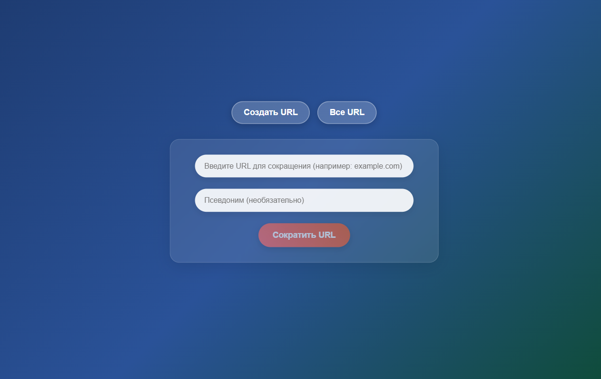
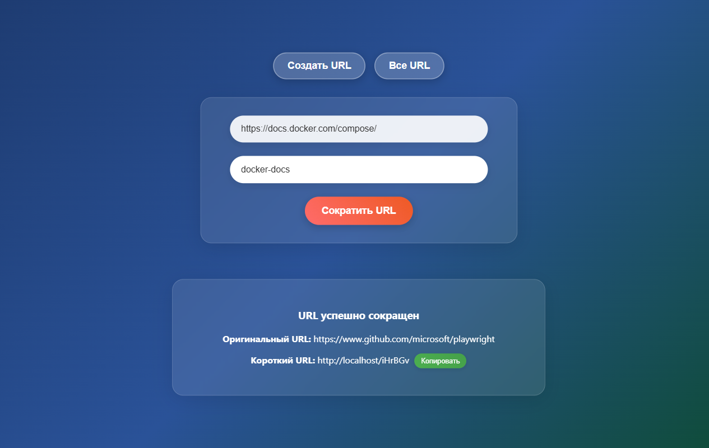
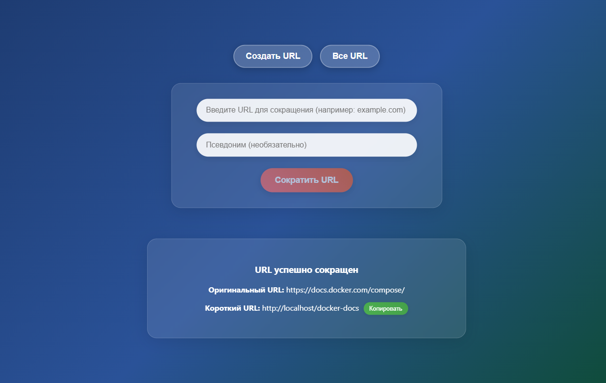
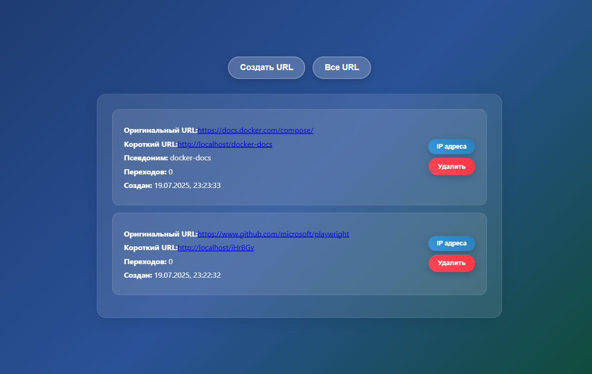
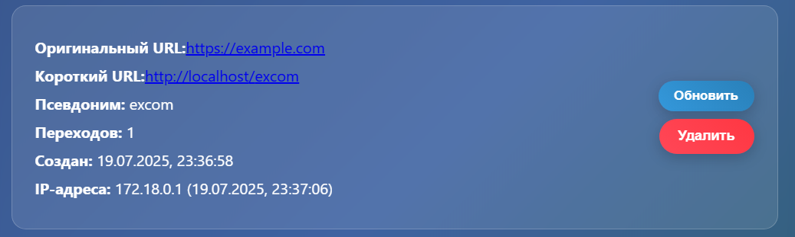

# URL Shortener 🔗

Веб-сервис для сокращения URL-адресов, построенный с использованием React, Node.js, TypeScript и PostgreSQL.

## 🚀 Особенности

- **Сокращение URL**: Преобразование длинных URL в короткие, удобные для использования ссылки
- **Пользовательские псевдонимы**: Возможность создания собственных коротких имен для ссылок
- **Список всех URL**: Просмотр всех созданных сокращенных ссылок
- **Современный UI**: Чистый и интуитивно понятный интерфейс
- **Контейнеризация**: Полная поддержка Docker для легкого развертывания

## 🛠 Технологический стек

### Frontend

- **React 19.1.0** - Современная библиотека для создания пользовательских интерфейсов
- **TypeScript** - Типизированный JavaScript для лучшей разработки
- **Axios** - HTTP клиент для API запросов
- **CSS3** - Стилизация с современными возможностями

### Backend

- **Node.js** - Серверная среда выполнения JavaScript
- **Express.js 5.1.0** - Веб-фреймворк для Node.js
- **TypeScript** - Типизированная разработка на сервере
- **TypeORM 0.3.25** - ORM для работы с базой данных
- **PostgreSQL** - Реляционная база данных
- **Helmet** - Безопасность HTTP заголовков
- **CORS** - Поддержка кросс-доменных запросов
- **Morgan** - HTTP логирование

### DevOps

- **Docker & Docker Compose** - Контейнеризация приложения
- **Nginx** - Веб-сервер для фронтенда
- **Jest** - Тестирование

## 📸 Скриншоты

### 1. Создание сокращенных ссылок

Процесс создания URL с автоматическим псевдонимом и с пользовательским псевдонимом:


_Чистый интерфейс при запуске_


_Заполнение формы с пользовательским псевдонимом_


_Успешно созданная сокращенная ссылка_

### 2. Управление ссылками

Просмотр, аналитика и удаление созданных URL:


_Список всех созданных ссылок с кнопками управления_


_Просмотр статистики переходов и IP-адресов_

## 🚀 Быстрый старт

### Предварительные требования

- Docker и Docker Compose
- Git

### Установка и запуск

1. **Клонируйте репозиторий**

   ```bash
   git clone <repository-url>
   cd url-shortener
   ```

2. **Запустите приложение с помощью Docker**

   ```bash
   docker-compose up -d
   ```

3. **Откройте приложение в браузере**
   ```
   http://localhost
   ```

### Порты

- **Frontend**: http://localhost (порт 80)
- **Backend API**: http://localhost:3000
- **PostgreSQL**: localhost:5432

## 📁 Структура проекта

```
url-shortener/
├── backend/                 # Node.js + Express API
│   ├── src/                # Исходный код сервера
│   ├── dist/               # Скомпилированный код
│   ├── tests/              # Тесты
│   ├── Dockerfile          # Docker конфигурация для backend
│   └── package.json        # Зависимости backend
├── frontend/               # React приложение
│   ├── src/                # Исходный код клиента
│   ├── public/             # Статические файлы
│   ├── Dockerfile          # Docker конфигурация для frontend
│   └── package.json        # Зависимости frontend
├── screenshots/            # Скриншоты приложения
├── docker-compose.yml      # Конфигурация Docker Compose
└── README.md              # Документация проекта
```

## 🔧 Разработка

### Локальная разработка

1. **Backend разработка**

   ```bash
   cd backend
   npm install
   npm run dev
   ```

2. **Frontend разработка**
   ```bash
   cd frontend
   npm install
   npm start
   ```

### Тестирование

```bash
# Backend тесты
cd backend
npm test

# Frontend тесты
cd frontend
npm test
```

## 🌟 Функциональность

### Основные возможности

- ✅ **Сокращение длинных URL** - Преобразование любых длинных ссылок в короткие
- ✅ **Создание пользовательских псевдонимов** - Возможность задать собственное имя для короткой ссылки
- ✅ **Автоматическая генерация псевдонимов** - Система автоматически создает уникальные короткие коды
- ✅ **Просмотр списка всех сокращенных ссылок** - Удобная таблица со всеми созданными URL
- ✅ **Счетчик переходов** - Отслеживание количества кликов по каждой ссылке
- ✅ **Аналитика IP-адресов** - Просмотр статистики переходов с детализацией по IP
- ✅ **Удаление ссылок** - Возможность удаления ненужных сокращенных URL
- ✅ **Переход по коротким ссылкам** - Автоматический редирект на оригинальные URL
- ✅ **Валидация URL** - Проверка корректности вводимых ссылок
- ✅ **Responsive дизайн** - Адаптивный интерфейс для всех устройств
- ✅ **Безопасность HTTP заголовков** - Защита с помощью Helmet
- ✅ **CORS поддержка** - Кросс-доменные запросы

### Протестированный функционал

1. **Создание URL без псевдонима** - Автоматическая генерация короткого кода
2. **Создание URL с пользовательским псевдонимом** - Использование собственного имени
3. **Просмотр списка всех URL** - Отображение всех созданных ссылок
4. **Аналитика переходов** - Просмотр статистики по IP-адресам
5. **Удаление URL** - Удаление ненужных ссылок из системы
6. **Переход по короткой ссылке** - Редирект на оригинальный URL
7. **Обновление счетчика** - Автоматическое увеличение счетчика переходов
8. **Навигация между вкладками** - Переключение между "Создать URL" и "Все URL"

### Планируемые улучшения

- 🔄 Расширенная аналитика (география, устройства, браузеры)
- 🔄 Срок действия ссылок с автоматическим удалением
- 🔄 Пользовательские аккаунты и авторизация
- 🔄 API документация (Swagger/OpenAPI)
- 🔄 Экспорт статистики в различных форматах
- 🔄 Массовое создание ссылок через CSV
- 🔄 QR-коды для коротких ссылок
- 🔄 Кастомные домены для ссылок

## 🤝 Вклад в проект

Мы приветствуем вклад в развитие проекта! Пожалуйста:

1. Форкните репозиторий
2. Создайте ветку для новой функции (`git checkout -b feature/amazing-feature`)
3. Зафиксируйте изменения (`git commit -m 'Add amazing feature'`)
4. Отправьте в ветку (`git push origin feature/amazing-feature`)
5. Откройте Pull Request

## 📄 Лицензия

Этот проект распространяется под лицензией ISC. Подробности в файле [LICENSE](LICENSE).

## 📞 Поддержка

Если у вас есть вопросы или предложения, пожалуйста, создайте [issue](../../issues) в репозитории.

---

**Создано с ❤️ для удобного сокращения ссылок**
